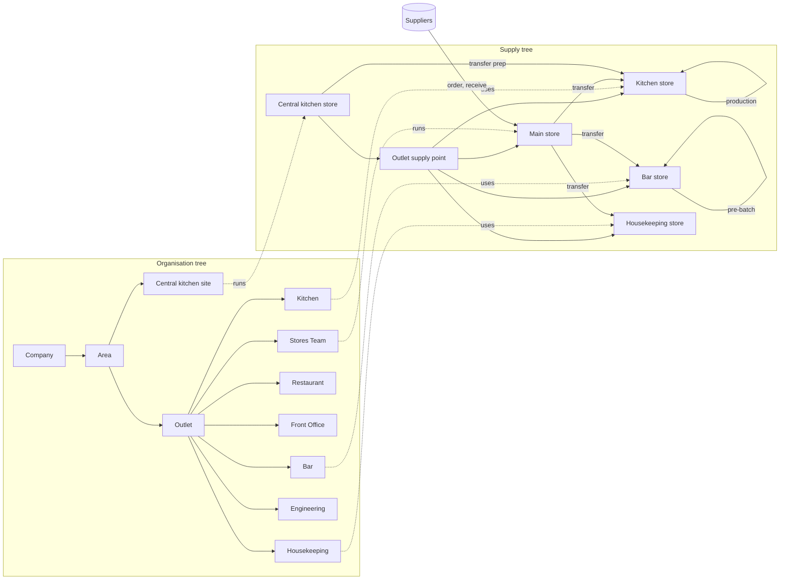

# System map: people, places and who uses what

Status: current as of 2026-10-02 (after ADR 021). This page describes what exists today.
`docs/ux-review.md` and `docs/reporting.md` describe what is proposed. The test customers
in `docs/onboarding/test-data` are the worked example.

## 1. Places

Every customer has **two trees** of places (ADR 009).

### The organisation tree: where people work

| Level      | Example                                                                                                                                                                                  | Notes                                                                                                   |
| ---------- | ---------------------------------------------------------------------------------------------------------------------------------------------------------------------------------------- | ------------------------------------------------------------------------------------------------------- |
| Company    | Test Company                                                                                                                                                                             | the customer                                                                                            |
| Region     | Test Region West                                                                                                                                                                         | optional                                                                                                |
| Area       | Test Area Mumbai                                                                                                                                                                         | an area manager's patch                                                                                 |
| Outlet     | Test Hotel & Bar 1.0, Test Bar 3.0                                                                                                                                                       | has a format: `full_hotel`, `small_hotel`, `standalone_bar`, …; has a time zone and a clock-in location |
| Site       | Test Central Kitchen                                                                                                                                                                     | a non-selling place (central kitchen)                                                                   |
| Department | Kitchen, Bar, Restaurant, Front Office, Housekeeping, Banquets, Stores Team, Engineering, Security, Admin & Finance, Floor Service; at the central kitchen, Production and Dispatch Team | optional: a small outlet (Test Guest House 2.0) has none, and everyone works at the outlet              |

### The supply tree: where stock is kept

| Level        | Example                                                                                       | Holds stock                                                   |
| ------------ | --------------------------------------------------------------------------------------------- | ------------------------------------------------------------- |
| Network      | Test Supply Network                                                                           | no                                                            |
| Hub          | Test Central Kitchen – Store                                                                  | yes: raw materials, and the prep it makes and sends out       |
| Supply point | Test Hotel & Bar 1.0 – Supply Point                                                           | usually no (a small outlet's supply point holds stock itself) |
| Store        | Main Store (raw materials, receives deliveries), Kitchen Store, Bar Store, Housekeeping Store | yes                                                           |

### How the two trees connect

**Node links** join them: the outlet uses its supply point, and the Kitchen department uses
the Kitchen Store.

- Pre-batched cocktails and mixers (Negroni, House Sangria, Sugar Syrup) are prep items made
  and kept in the **Bar Store**.
- Kitchen prep (Mint Chutney, Makhani Gravy) is made and kept in the **Kitchen Store**.
- The central kitchen makes prep in its hub store and transfers it to outlets.

### What is not modelled

Hotel **rooms**, **tables** and **guests**. Housekeeping works through tasks and
checklists at the Housekeeping department. Room-level work would need a PMS link (see
`docs/reporting.md` gaps).

## 2. People

### Inside a customer

Everyone has a **job role**. The role gives default **access groups** at places relative
to their home (file 06). Extra grants come from file 08 or the Admin screens.

| Kind of work                | Job roles (examples)                                                                                                                                                                        | Access groups                                                          | Bottom nav                                      |
| --------------------------- | ------------------------------------------------------------------------------------------------------------------------------------------------------------------------------------------- | ---------------------------------------------------------------------- | ----------------------------------------------- |
| Owner                       | Account Owner                                                                                                                                                                               | ACCOUNT_OWNER (admin of the company)                                   | Home, Inbox, Admin, Requests                    |
| Area                        | Area Manager                                                                                                                                                                                | AREA_MANAGER (view the area, approve large ones)                       | Home, Inbox, Stock, Roster, Tasks               |
| Outlet head                 | General Manager, Assistant GM; Bar Manager of a standalone bar                                                                                                                              | OUTLET_MANAGER (+ USER_ADMIN)                                          | Home, Inbox, Stock, Roster, Tasks               |
| Department head             | Executive Chef, Head Cook, Bar Manager (hotel), Executive Housekeeper, Front Office Manager, F&B / Restaurant / Banquet / Floor Manager, Chief Engineer, Security Supervisor, Store Manager | DEPARTMENT_HEAD (+ STORE_KEEPER of their store; EVENT_PLANNER for F&B) | Home, Inbox, Tasks, Roster, Stock or Requests   |
| Supervisor                  | Sous Chef, Head Bartender, Captain, Bell Captain, Housekeeping Supervisor, Banquet Captain                                                                                                  | SUPERVISOR (+ STOCK_USER of the store)                                 | as department head                              |
| Store                       | Store Keeper, Receiving Clerk; Central Kitchen Store Keeper                                                                                                                                 | STORE_KEEPER / STOCK_USER                                              | Home, Inbox, Stock, Tasks, Roster               |
| Central kitchen             | Central Kitchen Manager, Supervisor, Chef, Commis                                                                                                                                           | HUB_MANAGER, OUTLET_MANAGER (site), STOCK_USER, PRODUCTION_TEAM        | by kind of work                                 |
| Cost                        | Cost Controller                                                                                                                                                                             | COST_CONTROLLER                                                        | Home, Inbox, Stock, Menu, Requests              |
| Office                      | HR Executive, HR Admin, Security Admin, Auditor                                                                                                                                             | OUTLET_HR, HR_ADMIN, SECURITY_ADMIN, AUDITOR                           | Home, Inbox, Admin or Roster, Requests          |
| Frontline that makes things | Commis, Cook, Bartender, Chef de Partie, Laundry Attendant                                                                                                                                  | STAFF + PRODUCTION_TEAM or STOCK_USER                                  | Home, Tasks, Production or Stock, Roster, Inbox |
| Frontline                   | Server, Steward, Host, Cashier, Bellboy, Front Desk, Guest Relations, Room / Public Area Attendant, Kitchen Steward, Bar Back, Technician, Security Guard, Delivery Driver                  | STAFF (+ SELF for everyone)                                            | Home, Tasks, Roster, Inbox                      |

**One person, two jobs.** Access adds up: a person's job role gives their default access,
and extra groups can be granted on top (file 08 or Admin). The bottom nav follows their
most senior kind of work. Rostering uses only their own job role; rostering one person in a
second role is on hold (PRD section 15, open question 7).

`docs/onboarding/test-data/PRODUCT_access_groups_REFERENCE.csv` says what each group
allows. Each customer's `99_access_preview_GENERATED.csv` lists every person's access.

### Outside every customer

- **Platform admins** (`/platform`, ADR 012). They create customers, import their files and
  send logins, but never see customer data.
- **The AI agent** (planned, rule 6). It is a service user that views data and only
  proposes, through recommendations and workflow requests.

## 3. What each kind of person does in the app

| Area of the app                                   | Frontline                   | Supervisor    | Dept head                     | Store keeper   | Cost controller | Outlet head                                        | Area / owner / HR / audit                                             |
| ------------------------------------------------- | --------------------------- | ------------- | ----------------------------- | -------------- | --------------- | -------------------------------------------------- | --------------------------------------------------------------------- |
| My shifts, clock in/out, leave, swaps             | ✔                           | ✔             | ✔                             | ✔              | ✔               | ✔                                                  | HR: all leave (no screen yet)                                         |
| Roster (build, publish), attendance exceptions    | view own place              | view dept     | **build / resolve** dept      |                |                 | **build / resolve** outlet                         | area: view                                                            |
| Tasks: do my tasks, report a problem              | ✔                           | ✔             | ✔                             | ✔              | ✔               | ✔                                                  |                                                                       |
| Tasks: give out, team view, checklists, prep list |                             | dept          | dept (+ edit checklists)      |                |                 | outlet                                             | area: view                                                            |
| Maintenance: raise / assign / fix                 | raise; technician fixes     | raise         | raise; Engineering assigns    | raise          | raise           | assign                                             | area: view                                                            |
| Expired batches: report → assign → discard        | report; discard if assigned |               | assign                        |                |                 | assign; approve over limit                         |                                                                       |
| Production (record batches)                       | makers                      | makers        | ✔ (their store)               | ✔              |                 | ✔                                                  |                                                                       |
| Stock: view, count, wastage                       | stock users                 | stock users   | ✔ (their store)               | ✔              | view            | ✔                                                  | area: view                                                            |
| Orders: raise / approve / receive                 |                             |               | raise (store keeper of store) | raise, receive | view            | **approve**                                        | area / owner: approve large                                           |
| Transfers: request / dispatch / receive           | stock users request         |               | ✔                             | ✔              | view            | ✔                                                  | hub manager dispatches                                                |
| Recipes (read)                                    | their store's (no cost)     | their store's | with costs                    | no cost        | with costs      | with costs                                         | area: costs                                                           |
| Menu costs, prices, sales entry, variance         |                             |               |                               |                | **✔**           | ✔                                                  | area: view                                                            |
| Events                                            | view                        | view          | create (F&B)                  |                |                 | create                                             |                                                                       |
| Approvals (Inbox)                                 |                             |               | leave, swaps (first)          |                |                 | leave, swaps, orders, stock adjustments, transfers | area / owner: large orders, escalations; security admin: role changes |
| People and access (Admin)                         |                             |               |                               |                |                 | outlet (user admin)                                | owner: company; auditor: audit log                                    |

### Approval processes (Inbox)

LEAVE, SHIFT_SWAP, PURCHASE_ORDER, STOCK_ADJUSTMENT (count differences, wastage over the
limit, delivery excess), TRANSFER, ROLE_CHANGE.

The chain walks up from the place to whoever holds the group, and ends at the Account
Owner (ADR 010). The person who started a request never approves it.

### Background jobs

- **Executor** (every minute): carries out approved requests.
- **Nightly**: attendance exceptions and the location purge.
- **Tasks tick** (every 5 minutes): checklist rounds, reminders, escalation.
- **Platform worker**: creates customers and runs imports.

## 4. The diagram

The interactive version (pick a role, see their nav, places and flows) is published at
https://claude.ai/artifact/676WtVzMV2GwfsuaDB3Eot (private to the owner until shared). The Mermaid
version below is the same map, kept here so it stays with the code.

