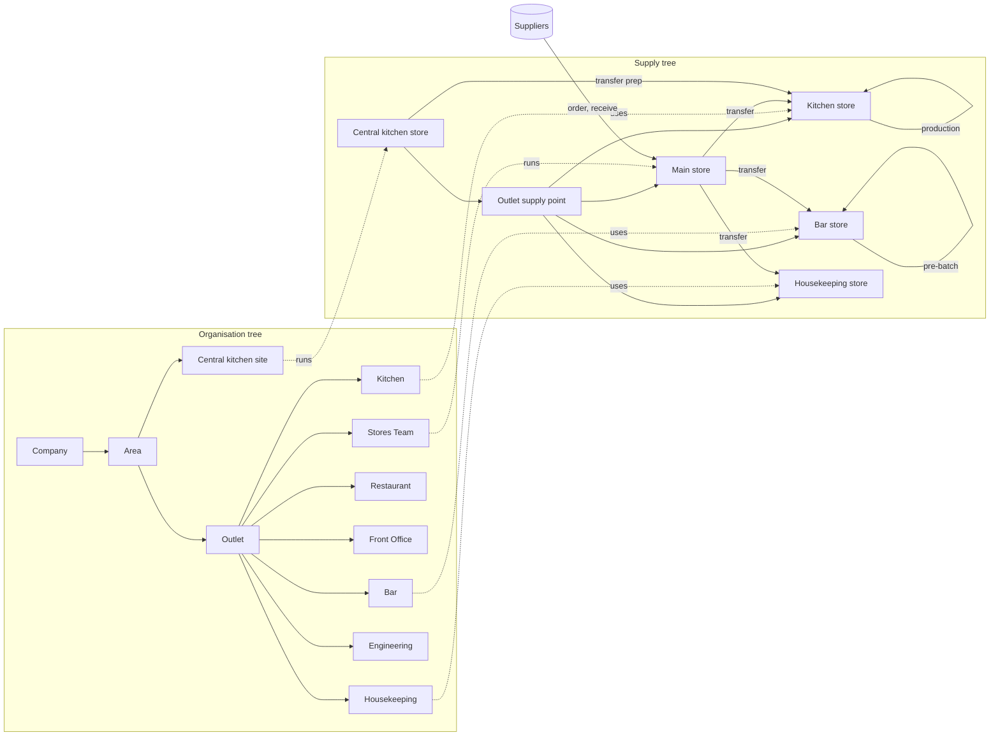

# System map: people, places and who uses what

Status: current as of 2026-10-04 (after ADR 046). This page describes what exists today.
`docs/ux-review.md` and `docs/reporting.md` describe what is proposed. The test customers
in `docs/onboarding/test-data` are the worked example.

## 1. Places

Every customer has **two trees** of places (ADR 009).

### The organisation tree: where people work

| Level      | Example                                                                                                                                                                                  | Notes                                                                                                                                                                                                           |
| ---------- | ---------------------------------------------------------------------------------------------------------------------------------------------------------------------------------------- | --------------------------------------------------------------------------------------------------------------------------------------------------------------------------------------------------------------- |
| Company    | Test Company                                                                                                                                                                             | the customer                                                                                                                                                                                                    |
| Region     | Test Region West                                                                                                                                                                         | optional                                                                                                                                                                                                        |
| Area       | Test Area Mumbai                                                                                                                                                                         | an area manager's patch                                                                                                                                                                                         |
| Outlet     | Test Hotel & Bar 1.0, Test Bar 3.0                                                                                                                                                       | has a format: `full_hotel`, `small_hotel`, `standalone_bar`, …; has a time zone and a clock-in location                                                                                                         |
| Site       | Test Central Kitchen                                                                                                                                                                     | a non-selling place (central kitchen)                                                                                                                                                                           |
| Department | Kitchen, Bar, Restaurant, Front Office, Housekeeping, Banquets, Stores Team, Engineering, Security, Admin & Finance, Floor Service; at the central kitchen, Production and Dispatch Team | optional: a small outlet (Test Guest House 2.0) has none, and everyone works at the outlet. Each has a type (kitchen, service, housekeeping, other) that orders Home's Needs attention: Kitchen first (ADR 033) |

### The supply tree: where stock is kept

| Level        | Example                                                                                       | Holds stock                                                   |
| ------------ | --------------------------------------------------------------------------------------------- | ------------------------------------------------------------- |
| Network      | Test Supply Network                                                                           | no                                                            |
| Hub          | Test Central Kitchen – Store                                                                  | yes: raw materials, and the prep it makes and sends out       |
| Supply point | Test Hotel & Bar 1.0 – Supply Point                                                           | usually no (a small outlet's supply point holds stock itself) |
| Store        | Main Store (raw materials, receives deliveries), Kitchen Store, Bar Store, Housekeeping Store | yes                                                           |

### How the two trees connect

**Node links** join them: the outlet uses its supply point, and the Kitchen department uses
the Kitchen Store.

- Pre-batched cocktails and mixers (Negroni, House Sangria, Sugar Syrup) are prep items made
  and kept in the **Bar Store**.
- Kitchen prep (Mint Chutney, Makhani Gravy) is made and kept in the **Kitchen Store**.
- The central kitchen makes prep in its hub store and transfers it to outlets.

### What is not modelled

Hotel **rooms**, **tables** and **guests**. Housekeeping works through tasks and
checklists at the Housekeeping department. Room-level work would need a PMS link (see
`docs/reporting.md` gaps).

## 2. People

### Two things decide what someone sees

1. **Level: how much they decide.** Doing the work, leading a shift (or running a store),
   running a department, running the outlet. This sets what they approve and whose work they
   see.
2. **Department and job: what the work is.** This sets their shifts, checklists, what they
   make, the store they use and the recipes they read.

A cook and a bartender are on the same level but do different jobs: the same rung of a
different ladder. The level is never a job description.

### The outlet, department by department (Test Hotel & Bar 1.0)

| Level ↓ / Department → | Kitchen                                         | Bar                 | Restaurant                      | Floor service (Bar 3.0) | Banquets        | Front Office                                         | Housekeeping                                             | Stores          | Engineering    | Security            |
| ---------------------- | ----------------------------------------------- | ------------------- | ------------------------------- | ----------------------- | --------------- | ---------------------------------------------------- | -------------------------------------------------------- | --------------- | -------------- | ------------------- |
| Runs the outlet        | General Manager, Assistant GM (all departments) |                     |                                 |                         |                 |                                                      |                                                          |                 |                |                     |
| Runs a department      | Executive Chef (Head Cook in a small outlet)    | Bar Manager         | F&B Manager, Restaurant Manager | Floor Manager           | Banquet Manager | Front Office Manager                                 | Executive Housekeeper                                    | Store Manager   | Chief Engineer | Security Supervisor |
| Leads a shift / store  | Sous Chef                                       | Head Bartender      | Captain                         |                         | Banquet Captain | Bell Captain                                         | Housekeeping Supervisor                                  | Store Keeper    |                |                     |
| Does the work          | Chef de Partie, Cook, Commis, Kitchen Steward   | Bartender, Bar Back | Steward, Host                   | Server, Cashier, Host   | Banquet Server  | Front Desk Executive, Guest Relations Exec., Bellboy | Room Attendant, Public Area Attendant, Laundry Attendant | Receiving Clerk | Technician     | Security Guard      |

Above the outlet: the Area Manager (the outlets of an area) and, company-wide, the Account
Owner, HR Admin, Security Admin and Auditor. HR Executive and Cost Controller work across
one outlet. The central kitchen has its own ladder (manager, supervisor, chef, commis, store
keeper, driver).

### Same level, different job

Everyone on the "does the work" level has the same personal screens (their shifts and
clock-in, leave, tasks, My week). What differs is the job (files 06, 16, 20 and 29):

| Job (department)              | Shifts                            | Checklists                                  | Makes                                                 | Store                                     | Recipes             |
| ----------------------------- | --------------------------------- | ------------------------------------------- | ----------------------------------------------------- | ----------------------------------------- | ------------------- |
| Cook (Kitchen, Bar 3.0)       | Kitchen Evening 16:00–00:00       | Kitchen opening 11:00, closing (on shift)   | Ginger Garlic Paste, Mint Chutney                     | Kitchen Store: counts, wastage, transfers | Kitchen, no costs   |
| Commis (Kitchen)              | Breakfast 06:00–14:00, Dinner     | Kitchen opening 07:00, fridge log every 4 h | Ginger Garlic Paste, Mint Chutney, Steamed Rice       | none (records batches)                    | Kitchen, no costs   |
| Bartender (Bar)               | Bar Evening 17:00–01:00, Bar Late | Bar setup 17:00, Bar closing (on shift)     | Sugar Syrup, Sour Mix, pre-batched Negroni and others | none (records batches)                    | Cocktails, no costs |
| Steward (Restaurant)          | Breakfast 06:30–14:30, Dinner     | tasks from the Captain                      | nothing                                               | none                                      | none                |
| Room Attendant (Housekeeping) | Morning 08:00–16:00, Evening      | Linen room count, Mondays 10:00             | nothing                                               | none                                      | none                |
| Public Area Attendant         | Morning, Evening                  | Lobby washroom check every 2 h              | nothing                                               | none                                      | none                |
| Laundry Attendant             | Morning 08:00–16:00               | tasks from the supervisor                   | nothing                                               | Housekeeping Store: counts, wastage       | none                |
| Front Desk Executive          | Morning, Evening, Night           | Shift handover 07:00, 15:00, 23:00          | nothing                                               | none                                      | none                |
| Technician (Engineering)      | Engineering Day 09:00–18:00       | repair requests assigned to them            | nothing                                               | none                                      | none                |
| Receiving Clerk (Stores)      | Stores Day 08:00–17:00            |                                             | nothing                                               | Main Store: counts, wastage, transfers    | none                |

The prospect-facing version, with any two jobs compared side by side, is the "Who does
what" page.

### Access behind it

Everyone has a **job role**. The role gives default **access groups** at places relative
to their home (file 06). Extra grants come from file 08 or the Admin screens. The first
column below is the level and kind of work, not a job description.

| Level / kind of work        | Job roles (examples)                                                                                                                                                                        | Access groups                                                          | Bottom nav                                         |
| --------------------------- | ------------------------------------------------------------------------------------------------------------------------------------------------------------------------------------------- | ---------------------------------------------------------------------- | -------------------------------------------------- |
| Owner                       | Account Owner                                                                                                                                                                               | ACCOUNT_OWNER (admin of the company; every report, read-only)          | Home, Inbox, Reports, Admin, Me                    |
| Area                        | Area Manager                                                                                                                                                                                | AREA_MANAGER (view the area, approve large ones)                       | Home, Inbox, Reports, Me                           |
| Outlet head                 | General Manager, Assistant GM; Bar Manager of a standalone bar                                                                                                                              | OUTLET_MANAGER (+ USER_ADMIN)                                          | Home, Inbox, Reports, Me                           |
| Department head             | Executive Chef, Head Cook, Bar Manager (hotel), Executive Housekeeper, Front Office Manager, F&B / Restaurant / Banquet / Floor Manager, Chief Engineer, Security Supervisor, Store Manager | DEPARTMENT_HEAD (+ STORE_KEEPER of their store; EVENT_PLANNER for F&B) | Home, Roster, Stock or Tasks, Reports, Me          |
| Supervisor                  | Sous Chef, Head Bartender, Captain, Bell Captain, Housekeeping Supervisor, Banquet Captain                                                                                                  | SUPERVISOR (+ STOCK_USER of the store)                                 | as department head                                 |
| Store                       | Store Keeper, Receiving Clerk; Central Kitchen Store Keeper                                                                                                                                 | STORE_KEEPER / STOCK_USER                                              | Home, Stock, Tasks, Me                             |
| Central kitchen             | Central Kitchen Manager, Supervisor, Chef, Commis                                                                                                                                           | HUB_MANAGER, OUTLET_MANAGER (site), STOCK_USER, PRODUCTION_TEAM        | by kind of work                                    |
| Cost                        | Cost Controller                                                                                                                                                                             | COST_CONTROLLER                                                        | Home, Stock, Reports, Inbox, Me                    |
| Office                      | HR Executive, HR Admin, Security Admin, Auditor                                                                                                                                             | OUTLET_HR, HR_ADMIN, SECURITY_ADMIN, AUDITOR                           | Home, Inbox, Reports (if any), Admin or Roster, Me |
| Frontline that makes things | Commis, Cook, Bartender, Chef de Partie, Laundry Attendant                                                                                                                                  | STAFF + PRODUCTION_TEAM or STOCK_USER                                  | Home, Tasks, Me                                    |
| Frontline                   | Server, Steward, Host, Cashier, Bellboy, Front Desk, Guest Relations, Room / Public Area Attendant, Kitchen Steward, Bar Back, Technician, Security Guard, Delivery Driver                  | STAFF (+ SELF for everyone; + CASHIER for cashiers, ADR 039)           | Home, Tasks, Me                                    |

**One person, two jobs.** Access adds up: a person's job role gives their default access,
and extra groups can be granted on top (file 08 or Admin). The bottom nav follows their
most senior kind of work (UX-6, ADR 034): frontline staff get three tabs and four tiles
on Home; everyone's other screens are on **Me**, and Approvals sits in the header for
anyone without the tab. Rostering uses only their own job role; rostering one person in a
second role is on hold (PRD section 15, open question 7).

`docs/onboarding/test-data/PRODUCT_access_groups_REFERENCE.csv` says what each group
allows. Each customer's `99_access_preview_GENERATED.csv` lists every person's access.

### Outside every customer

- **Platform admins** (`/platform`, ADR 012). They create customers, import their files and
  send logins, but never see customer data.
- **The AI agent** (planned, rule 6). It is a service user that views data and only
  proposes, through recommendations and workflow requests.

## 3. What each kind of person does in the app

| Area of the app                                                                           | Frontline                   | Supervisor          | Dept head                                                                | Store keeper                             | Cost controller                    | Outlet head                                        | Area / owner / HR / audit                                             |
| ----------------------------------------------------------------------------------------- | --------------------------- | ------------------- | ------------------------------------------------------------------------ | ---------------------------------------- | ---------------------------------- | -------------------------------------------------- | --------------------------------------------------------------------- |
| My shifts, clock in/out, leave, swaps (swaps: managers only by default, ADR 035)          | ✔                           | ✔                   | ✔                                                                        | ✔                                        | ✔                                  | ✔                                                  | HR: all leave (no screen yet)                                         |
| Clock-in selfie and device (ADR 045): a selfie at clock-in; new or shared phone flagged   | ✔ (flagged if no camera)    |                     | sees selfies and flags (their department)                                |                                          |                                    | sees flags, not selfies                            | HR: sees selfies and flags; area, owner: no                           |
| Roster (build, publish), attendance exceptions                                            | view own place              | view dept           | **build / resolve** dept                                                 |                                          |                                    | **build / resolve** outlet                         | area: view                                                            |
| Tasks: do my tasks, report a problem                                                      | ✔                           | ✔                   | ✔                                                                        | ✔                                        | ✔                                  | ✔                                                  |                                                                       |
| Tasks: give out, team view, checklists, prep list                                         |                             | dept                | dept (+ edit checklists)                                                 |                                          |                                    | outlet                                             | area: view                                                            |
| Maintenance: raise / assign / fix                                                         | raise; technician fixes     | raise               | raise; Engineering assigns                                               | raise                                    | raise                              | assign                                             | area: view                                                            |
| Expired batches: report → assign → discard                                                | report; discard if assigned |                     | assign                                                                   |                                          |                                    | assign; approve over limit                         |                                                                       |
| Production (record batches)                                                               | makers                      | makers              | ✔ (their store)                                                          | ✔                                        |                                    | ✔                                                  |                                                                       |
| Stock: view, count, wastage                                                               | stock users                 | stock users         | ✔ (their store)                                                          | ✔                                        | view                               | ✔                                                  | area: view                                                            |
| Stock check (ADR 043): count blind, add a photo to each difference, finish; Verified tags |                             |                     | sees tags (their store)                                                  | sees tags                                | **verifies** (or a Stock Verifier) | sees tags; told of differences                     | area: —                                                               |
| Orders: raise / approve / receive                                                         |                             |                     | raise (store keeper of store); approves unusual orders (PO-5, ADR 044)   | raise, receive                           | view                               | told of every order; approves too (not their own)  | area / owner: approve large                                           |
| Transfers: request / dispatch / receive                                                   | stock users request         |                     | ✔                                                                        | ✔                                        | view                               | ✔                                                  | hub manager dispatches                                                |
| Request for material, RFM (ADR 044): a request into a department's store                  | stock users request         |                     | approves if off the menu or more than usual                              | issues (sends)                           | view                               | approves too; told of orders                       | hub manager dispatch                                                  |
| Recipes (read)                                                                            | their store's (no cost)     | their store's       | with costs                                                               | no cost                                  | with costs                         | with costs                                         | area: costs                                                           |
| Menu costs, prices, sales entry                                                           |                             |                     |                                                                          |                                          | **✔**                              | ✔                                                  | area: view                                                            |
| POS import (ADR 039): upload the day's file; match POS codes                              | cashier: upload, match      |                     |                                                                          |                                          | upload, match                      | upload, match                                      |                                                                       |
| Expiry (ADR 040): morning alert; Push today on Home                                       | service teams: Push today   |                     | alert (their store's team)                                               |                                          |                                    | alert if no dept head; Push today                  |                                                                       |
| Report rows open their trend (ADR 041): a dish, a stock item                              |                             |                     | their store's items                                                      | stock items (their store)                | ✔                                  | ✔                                                  | owner: everything, read-only                                          |
| The lists behind a figure (ADR 042): dishes, wastage, stock, people, tasks, readings      |                             |                     | their department, with names                                             |                                          | dishes, wastage, stock; no names   | ✔, with names                                      | owner: everything, read-only                                          |
| Events                                                                                    | view (on My shifts)         | view (on My shifts) | create (F&B)                                                             |                                          |                                    | create                                             |                                                                       |
| Approvals (Inbox)                                                                         |                             |                     | leave, swaps (first); unusual orders and requests for material (ADR 044) |                                          |                                    | leave, swaps, orders, stock adjustments, transfers | area / owner: large orders, escalations; security admin: role changes |
| Reports (ADR 023)                                                                         | My week                     | dept today          | dept today (+ their store)                                               | My week                                  | outlet today                       | outlet today, dept today                           | area: outlets and depts; HR: depts; owner: everything, read-only      |
| Cost reports (ADR 028): cost of sales, menu engineering, stock position, purchasing       |                             |                     | their store's                                                            | stock position, purchasing (their store) | all four                           | all four                                           | owner: everything, read-only                                          |
| Labour cost, People, Central kitchen (ADR 030)                                            |                             |                     |                                                                          | Central kitchen (kitchen store keeper)   |                                    | labour cost; People (outlet HR); kitchen managers  | area, HR admin: labour; HR: People; owner: everything, read-only      |
| Outlets side by side (ADR 031): the league table                                          |                             |                     |                                                                          |                                          |                                    |                                                    | area manager: their area; owner: company, regions, areas              |
| Send an order to its supplier (ADR 032): WhatsApp, email, print                           |                             |                     | their store's orders                                                     | ✔                                        |                                    | ✔                                                  |                                                                       |
| Targets and settings (ADR 031)                                                            |                             |                     |                                                                          |                                          |                                    |                                                    | owner: changes; other admins: see                                     |
| Team → People and Leave; ask to deactivate (ADR 035)                                      |                             |                     |                                                                          |                                          |                                    | ✔ (WORKERS modify)                                 | HR: ✔; security admin approves the deactivation                       |
| People and access (Admin)                                                                 |                             |                     |                                                                          |                                          |                                    | outlet (user admin)                                | owner: company; auditor: audit log                                    |

Roster has two sides (ADR 025): **Me** (My shifts, Clock, Leave, Swaps) for everyone who
works shifts, and **Team** (Roster, Exceptions, Events, and People and Leave for those who manage worker
records, ADR 035) for people who build rosters, resolve exceptions or plan events, and for
people above outlet level. Frontline staff see
only Me.

**Customer access groups** (ADR 027). A company may build its own groups from the product's
rights (Admin → Access groups, Account Owner; or file 05). A group can carry a role's
requests and approvals: Test Company's Kitchen Lead (Sous Chef 1.1, Hotel 1.1 kitchen)
approves like the department head.

**Modules** (ADR 026). Each company can switch off Events, Shift swaps, Leave, Production,
Prep lists, Checklists, Maintenance, and Menu and sales (Admin → Modules, Account Owner
only). What is off disappears from the table above for everyone in that company. Test Solo
Bar Co. has Events and Swaps off.

### Approval processes (Inbox)

LEAVE, SHIFT_SWAP, PURCHASE_ORDER (only unusual ones, ADR 044: off the menu or more than
usual; the department head or the GM, then the area manager above ₹50,000), STOCK_ADJUSTMENT
(old-count differences beyond tolerance, wastage over the limit, delivery excess; a stock
check difference needs no approval, ADR 043), TRANSFER (a request for material that is off the
menu or more than usual first goes to the department head or the GM), ROLE_CHANGE, DEACTIVATION (a leaver, approved by the
security admin, ADR 035).

The chain walks up from the place to whoever holds the group, and ends at the Account
Owner (ADR 010). The person who started a request never approves it.

### Background jobs

- **Executor** (every minute): carries out approved requests.
- **Nightly** (02:15): attendance exceptions, the location purge and the removal of
  selfies and devices past the retention rule (ADR 045), then the report tables for the
  last 35 days (ADR 023).
- **Tasks tick** (every 5 minutes): checklist rounds, reminders, escalation.
- **Platform worker**: creates customers and runs imports.

## 4. The diagram

The interactive version (pick a role, see their nav, places and flows) is published at
https://claude.ai/artifact/676WtVzMV2GwfsuaDB3Eot (private to the owner until shared). The Mermaid
version below is the same map, kept here so it stays with the code.

